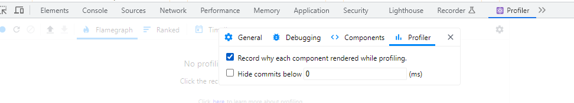
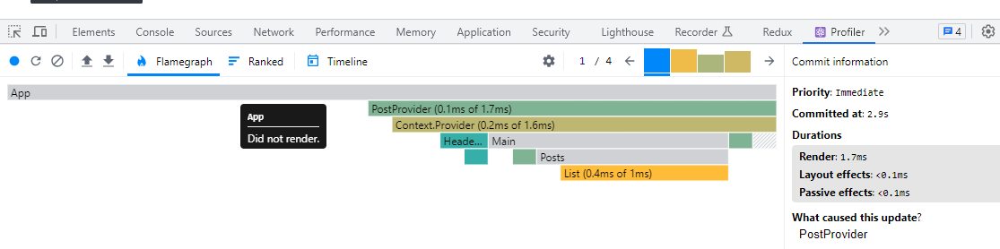
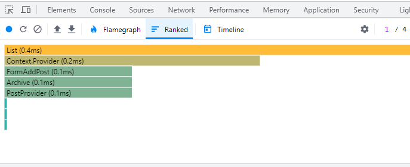

## 리액트 Profiler tool(Chrome)

 

### 1. Profiler record 설정

 

### 2. state 변화 record (시작🔵 ->  종료🔴)

 

### 3. Flamegraph

- 회색 : 렌더링 x
- 색이 짙어질수록 렌더링 많이 일어난 컴포넌트
- 바 length : 길수록 렌더링에 소요된 시간 많음
- 바 hover시 렌더링 원인 & 시간 팝업
   

### Rank

- 컴포넌트 렌더링 ranking

